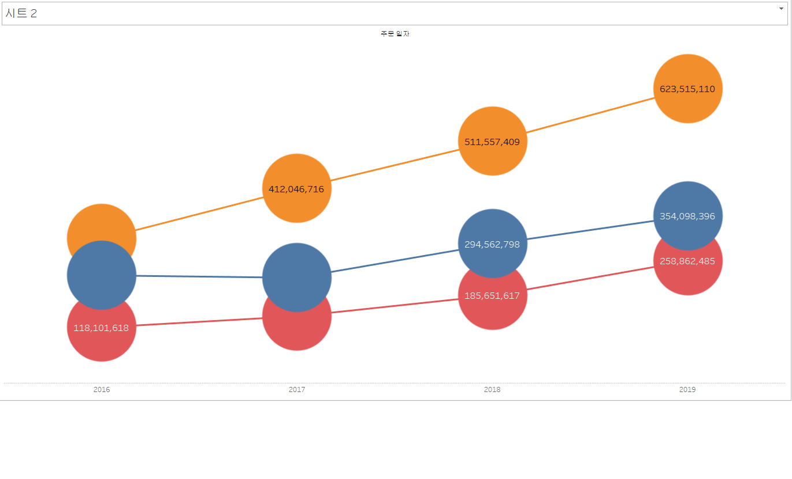
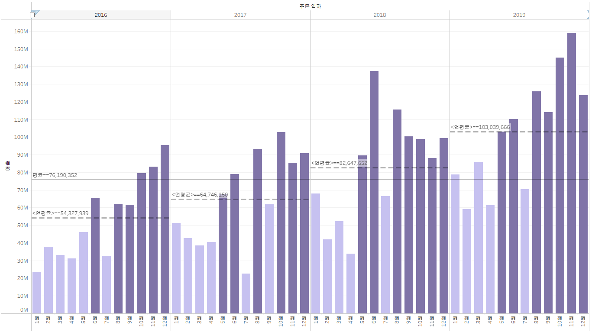
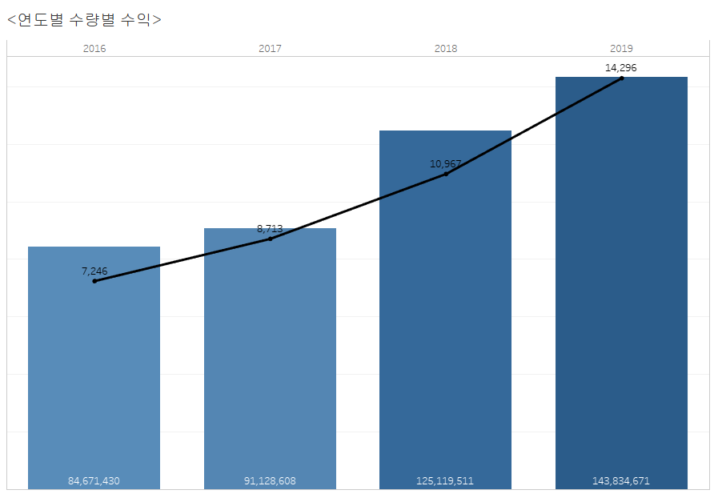
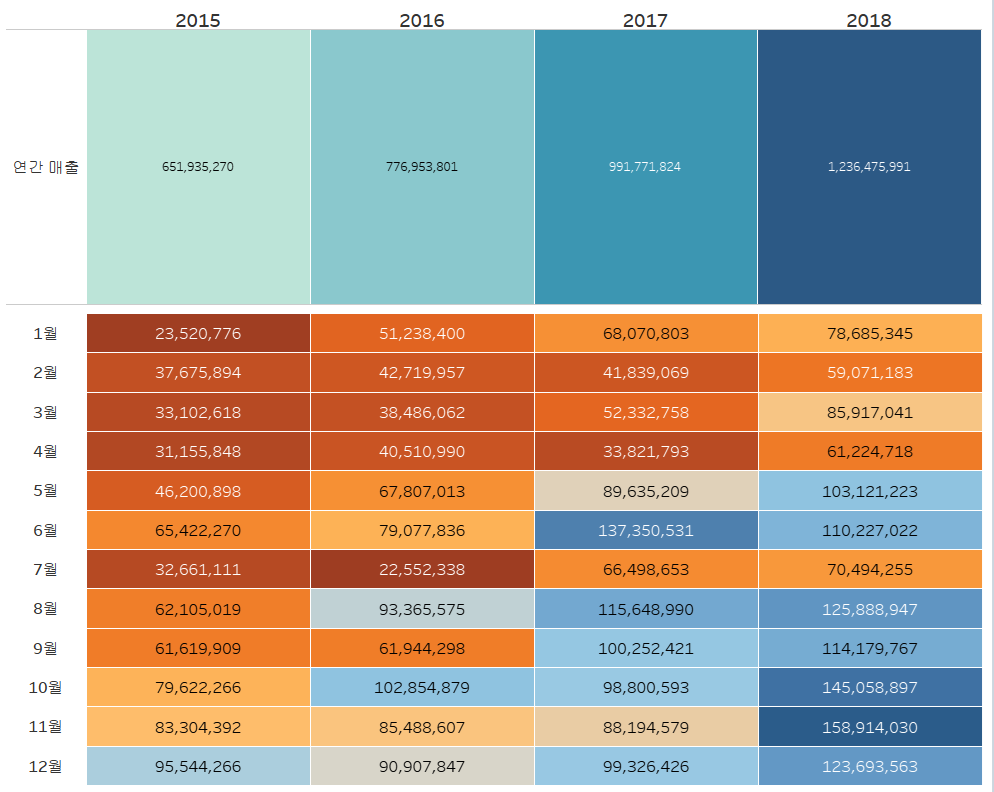
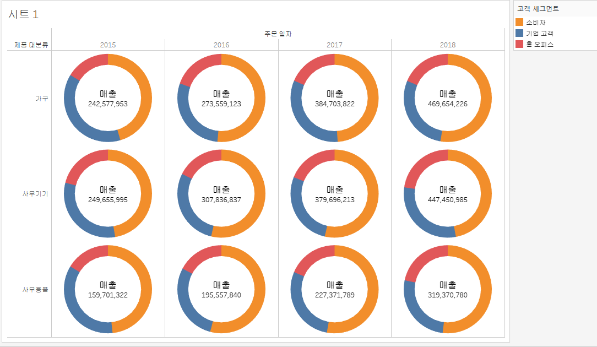
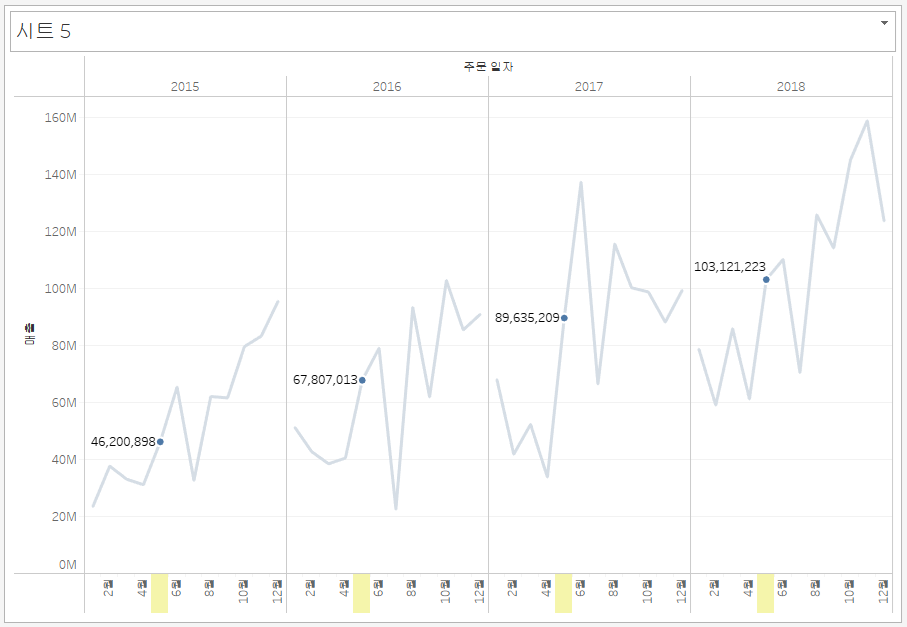
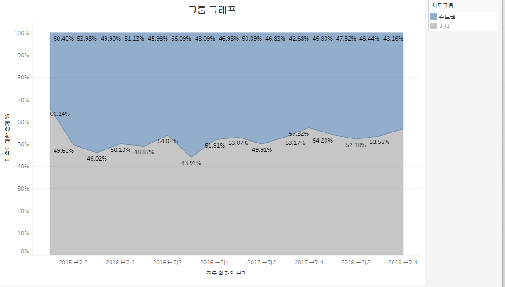
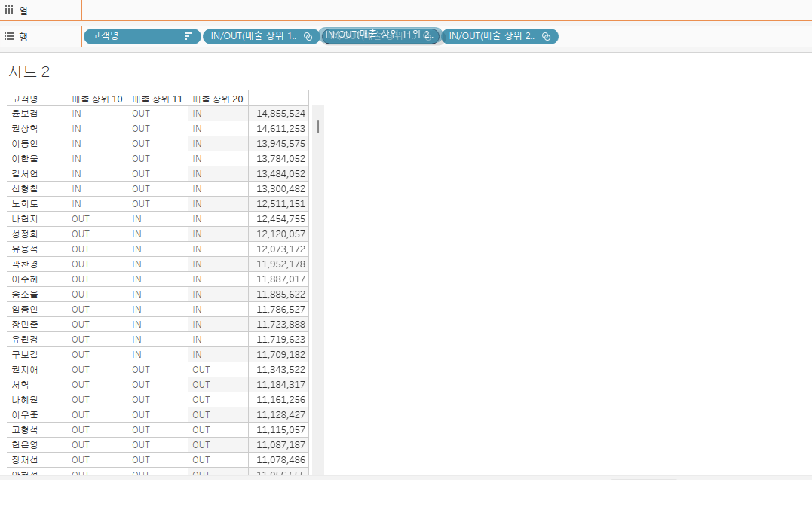
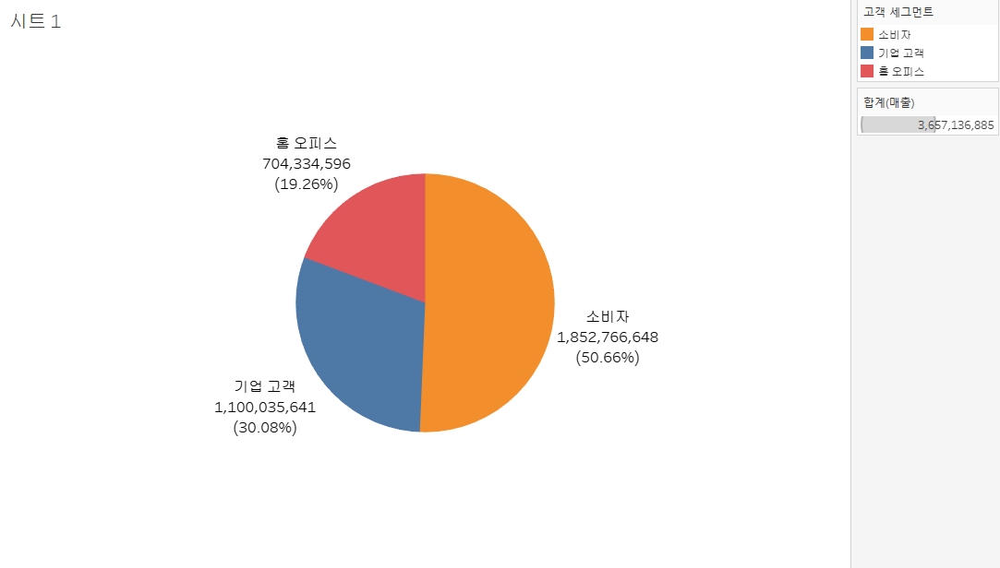

# Tableau 시각화

## 목차
1. [고객별 재구매 시기 데이터 분석 테블로 시각화](#1-고객별-재구매-시기-데이터-분석-테블로-시각화)
2. [고객세그먼트별 매출액 추이 그래프](#2-고객세그먼트별-매출액-추이-그래프)
3. [고객세그먼트별 매출액 누적 막대 그래프](#3-고객세그먼트별-매출액-누적-막대-그래프)
4. [년도별 매출액 영역 차트 그래프](#4-년도별-매출액-영역-차트-그래프)
5. [월별 매출액 년도 비교 그래프](#5-월별-매출액-년도-비교-그래프)
6. [라운드형 막대 그래프](#6-라운드형-막대-그래프)
7. [연도별 매출액 비교 라인 그래프](#7-연도별-매출액-비교-라인-그래프)
8. [제품별 매출액 계층 그래프](#8-제품별-매출액-계층-그래프)
9. [위도 경도 그래프](#9-위도-경도-그래프)
10. [채워진 지도 그래프](#10-채워진-지도-그래프)
11. [기호맵 지도 그래프](#11-기호맵-지도-그래프)
12. [결합된 축 그래프](#12-결합된-축-그래프)
13. [기호맵 그래프](#13-기호맵-그래프)
14. [대쉬보드 그래프](#14-대쉬보드-그래프)
15. [도넛 차트 그래프](#15-도넛-차트-그래프)
16. [두 개의 라인 그래프](#16-두-개의-라인-그래프)
17. [라인 하이라이트 그래프](#17-라인-하이라이트-그래프)
18. [박스 플롯 그래프](#18-박스-플롯-그래프)
19. [산포도 그래프](#19-산포도-그래프)
20. [수도권과 기타 지역 매출 영역 그래프](#20-수도권과-기타-지역-매출-영역-그래프)
21. [지도 파이 차트](#21-지도-파이-차트)
22. [지도 파이 차트2](#22-지도-파이-차트2)
23. [고객별 매출 순위 그래프](#23-고객별-매출-순위-그래프)
24. [차이 그래프](#24-차이-그래프)
25. [챗지피티 이후 일자리 변화 그래프](#25-챗지피티-이후-일자리-변화-그래프)
26. [트리맵 그래프](#26-트리맵-그래프)
27. [파이 차트 그래프](#27-파이-차트-그래프)

---

## 1. 고객별 재구매 시기 데이터 분석 테블로 시각화

- **설명**: 고객별 두 번째 구매까지 걸린 날짜(구간 단위)와 고객들의 교차 카운트를 히스토그램으로 시각화.
- **특징**: 평균 100일 구간에 해당하는 고객 수가 많으며, 교차 카운트는 25명.

---

## 2. 고객세그먼트별 매출액 추이 그래프

- **설명**: 고객 세그먼트별 연도별 매출 추이를 라인 차트와 데이터 레이블로 표시.
- **특징**: 전반적인 추세를 한눈에 파악 가능.

---

## 3. 고객세그먼트별 매출액 누적 막대 그래프

- **설명**: 고객 세그먼트별 매출액 누적을 막대 그래프로 표현.
- **특징**: 세그먼트별 기여도를 비교.

---

## 4. 년도별 매출액 영역 차트 그래프

- **설명**: 년도별 매출액을 영역 차트로 시각화.
- **특징**: 연도별 매출 변화 추이를 명확히 보여줌.

---

## 5. 월별 매출액 년도 비교 그래프

- **설명**: 월별 매출액을 라인 그래프와 막대 그래프로 시각화.
- **특징**: 월별 매출 변화를 두 가지 형식으로 비교.

---

## 6. 라운드형 막대 그래프

- **설명**: 지역별 매출 변화를 라운드형 막대 그래프로 시각화.
- **특징**: 지역 간 매출 격차를 직관적으로 파악 가능.

---

## 7. 연도별 매출액 비교 라인 그래프
  

- **설명**: 연도별 주문 일자의 매출액 변화를 월별로 나타내고, 평균 영역을 보여줌.

---

## 8. 제품별 매출액 계층 그래프

- **설명**: 제품 분류별 매출액을 나타냄.

- **설명**: 지역별 매출액을 나타냄.

---

## 9. 위도 경도 그래프

- **설명**: 지역별 위도와 경도 정보를 매출과 결합하여 시각화.
- **특징**: 특정 지역의 매출 데이터를 직관적으로 확인.

---

## 10. 채워진 지도 그래프

- **설명**: 서울 권역 5개의 구를 시각화하여 지역별 데이터를 명확히 표시.

---

## 11. 기호맵 지도 그래프

- **설명**: 우리나라 전체 지도의 시군구별 수량과 수익을 시각화.

---

## 12. 결합된 축 그래프

- **설명**: 주문일자에 대해 결합된 시각화한 그래프.

---

## 13. 기호맵 그래프

- **설명**: 연도별 수량을 연도별로 시각화한 그래프.

---

## 14. 대쉬보드 그래프

- **설명**: 연도별 연간 매출과 월별로 대쉬보드 스타일로 시각화한 그래프.

---

## 15. 도넛 차트 그래프

- **설명**: 연도별 제품군 매출을 도넛 차트로 시각화.

---

## 16. 두 개의 라인 그래프

- **설명**: 월별 매출과 누적 합계를 두 개의 라인으로 시각화.

---

## 17. 라인 하이라이트 그래프

- **설명**: 월별 매출과 누적 합계를 하이라이트 라인으로 시각화.

---

## 18. 박스 플롯 그래프

- **설명**: 시도별 수익을 박스 플롯 형태로 시각화.

---

## 19. 산포도 그래프

- **설명**: 수익을 할인율에 대하여 산포도 그래프로 시각화하고 추세선을 표시.

---

## 20. 수도권과 기타 지역 매출 영역 그래프

- **설명**: 수도권과 기타 지역 매출을 분기별 영역 차트로 시각화.

---

## 21. 지도 파이 차트

- **설명**: 지도형태로 시각화를 한 다음 매출 추이를 파이 차트로 결합하여 표현.

---

## 22. 지도 파이 차트2

- **설명**: 지도형태로 시각화를 한 다음 서울시권역만 뽑아 매출에 대한 추이 형태 파이 차트로 시각화하여 결합한 그래프.

---

## 23. 고객별 매출 순위 그래프

- **설명**: 고객별로 매출 순위를 보여주는 차트.

---

## 24. 차이 그래프

- **설명**: 분기별 매출 차이를 시각화.

---

## 25. 챗지피티 이후 일자리 변화 그래프

- **설명**: 챗지피티 이후 일자리 변화를 시각화.

---

## 26. 트리맵 그래프

- **설명**: 제품별 수익 순위를 트리맵으로 표현.
- **특징**: 각 제품의 기여도를 면적 크기로 표시.

---

## 27. 파이 차트 그래프

- **설명**: 고객 세그먼트별 매출을 파이 차트로 시각화.
