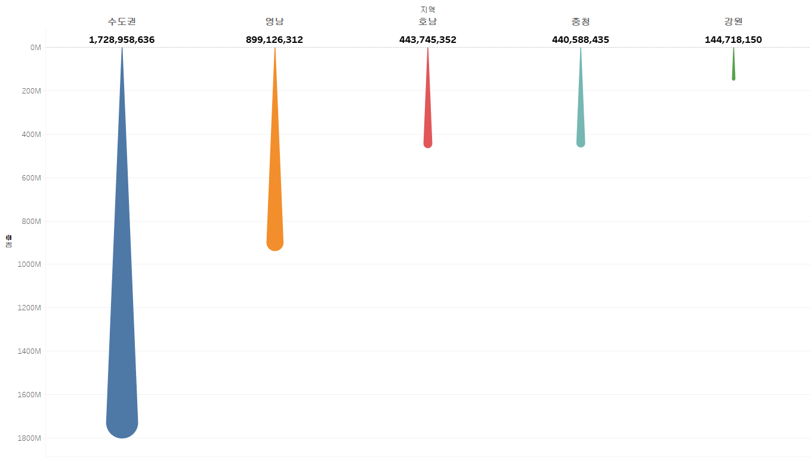
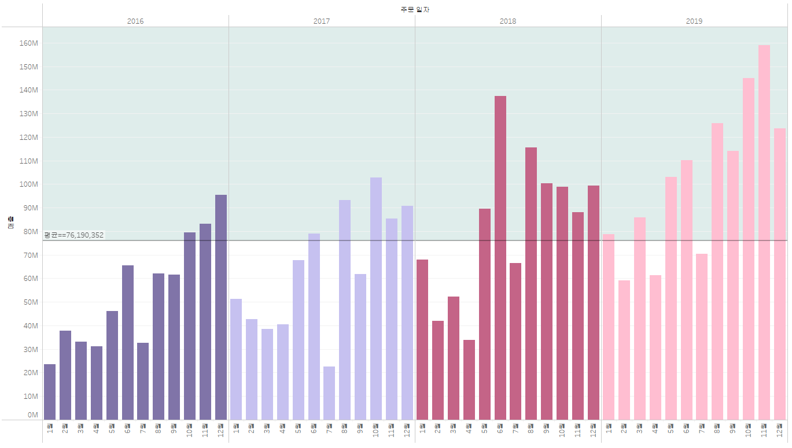

# Tableau

# 1. 고객별 재구매 시기 데이터 분석 테블로 시각화

이 그래프는 고객별 두 번째 구매까지 걸린 날짜(구간 단위)와 고객들의 교차 카운트를 나타냅니다. 각 막대는 특정 구간에 해당하는 고객 수를 보여주며, 높이가 높을수록 그 구간에 해당하는 고객의 재구매 비율이 높은 것을 의미합니다. 

예를 들어, 그래프에서 100일 구간에 해당하는 막대는 고객들이 두 번째 구매까지 걸린 평균 기간이 100일임을 나타내며, 교차 카운트는 25명입니다.

# 2. 고객세그먼트별 매출액 추이 그래프

라인은 전반적인 추세를 보는데 적합하고 원은 원안에다가 연도별 고객 세그먼트의 매출을 원안에 표시하는데 적합한 차트 형식입니다.

# 3. 고객세그먼트별 매출액 누적 막대 그래프

# 4. 년도별 매출액 영역 차트 그래프

# 5. 월별 매출액 년도 비교 그래프

# 6. 라운드형 막대 그래프

이 그래프는 지역별 매출액 변화를 나타냅니다.

# 7. 연도별 매출액 비교 라인 그래프
  
이 그래프는 연도별 주문 일자의 매출액 변화를 월별로 나타내고, 평균 영역을 보여줍니다.

# 8. 제품별 매출액 계층 그래프

이 그래프는 제품 분류별 매출액을 나타냅니다.

이 그래프는 지역별 매출액을 나타냅니다.

# 9. 위도 경도 그래프

이 그래프는 지역별 위도 경도로 위치를 나타냅니다.

# 10. 채워진 지도 그래프

이 그래프는 서울 권역 5개의 구를 한눈에 볼 수 있는 것을 보여줍니다.

# 11. 기호맵 지도 그래프

이 그래프는 우리나라 전체 지도의 시군구별 수량 수익을 시각화한 그래프 입니다.

